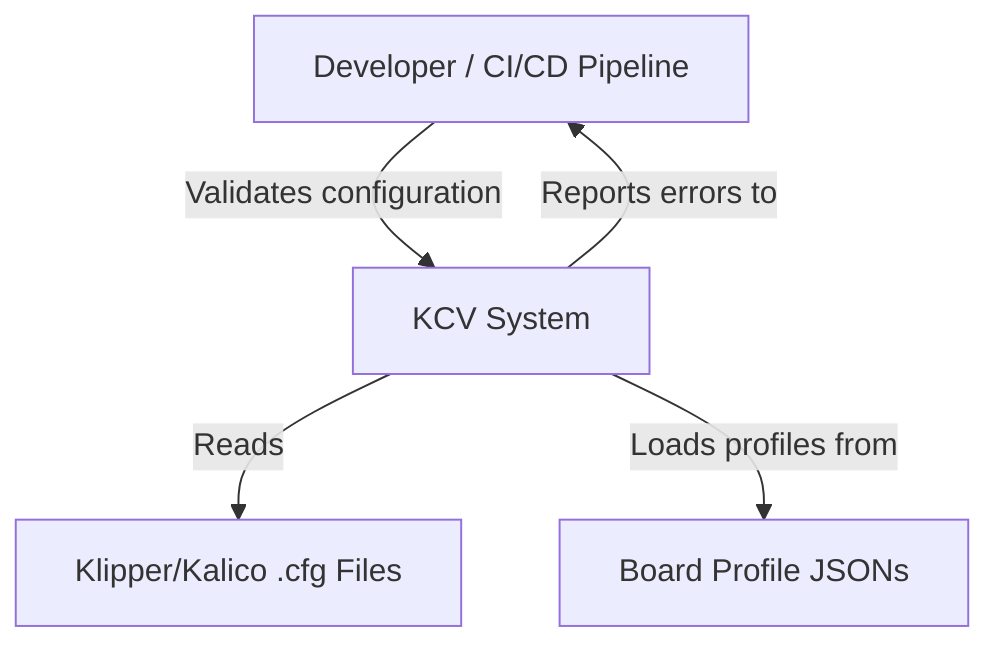
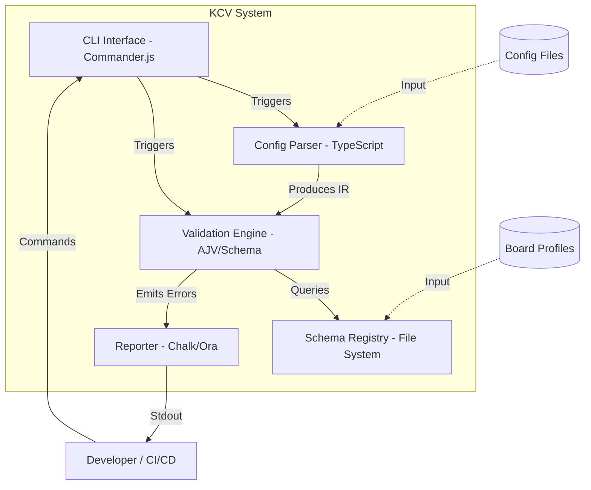
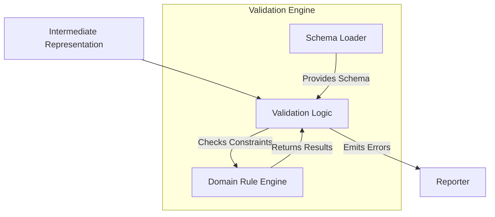
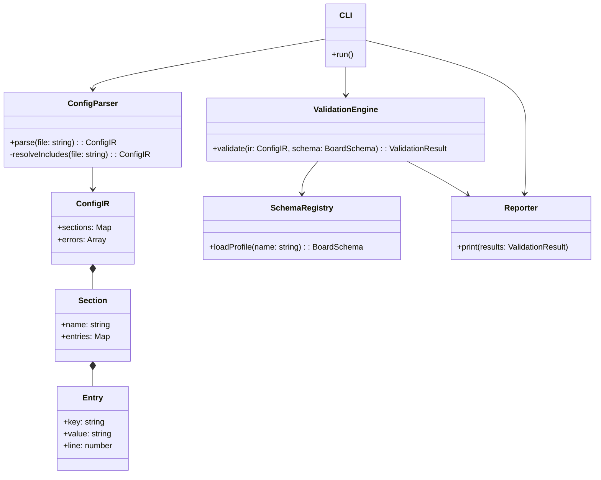

# C4 System Design Document: KCV (Klipper Config Validator)

This document follows the C4 model to describe the architecture of the KCV system at four levels of abstraction.

---

## Level 1: System Context Diagram

The System Context diagram shows the KCV system in the context of its users and the external entities it interacts with.

**External Actors & Systems:**
*   **Developer / CI/CD Pipeline:** The primary user who triggers the validation process.
*   **Klipper/Kalico .cfg Files:** The input files being validated.
*   **Board Profile JSONs:** The external data source defining the "rules" for specific hardware.

---

## Level 2: Container Diagram

The Container diagram zooms into the KCV system to show its high-level technical building blocks.

**Containers:**
*   **CLI Interface:** Handles user input, command-line arguments, and orchestration.
*   **Config Parser:** Performs lexical analysis and handles recursive file inclusion.
*   **Validation Engine:** The core logic that compares the parsed data against schemas.
*   **Schema Registry:** A simple file-system-based registry for loading JSON profiles.
*   **Reporter:** Formats and outputs errors and warnings to the terminal.

---

## 3. Level 3: Component Diagram

The Component diagram zooms into the **Validation Engine** container to show its internal components.

**Components (within Validation Engine):**
*   **Schema Loader:** Responsible for reading and parsing the JSON Board Profiles.
*   **Validation Logic:** The main orchestrator that iterates through the IR and applies the schema.
*   **Domain Rule Engine:** A specialized component for non-standard rules (e.g., custom Regex for GPIO pins or specific numerical ranges).

---

## 4. Level 4: Code Diagram (Class Structure)

The Code diagram shows the high-level class structure and relationships within the TypeScript implementation.

**Key Classes:**
*   **`CLI`**: The entry point.
*   **`ConfigParser`**: Handles the transformation of raw text into the `ConfigIR`.
*   **`ConfigIR` (Intermediate Representation)**: A structured object model representing the configuration, including source mapping (line numbers).
*   **`ValidationEngine`**: The core logic that performs the semantic checks.
*   **`SchemaRegistry`**: Manages the loading of different hardware profiles.
*   **`Reporter`**: Handles the final output formatting.
